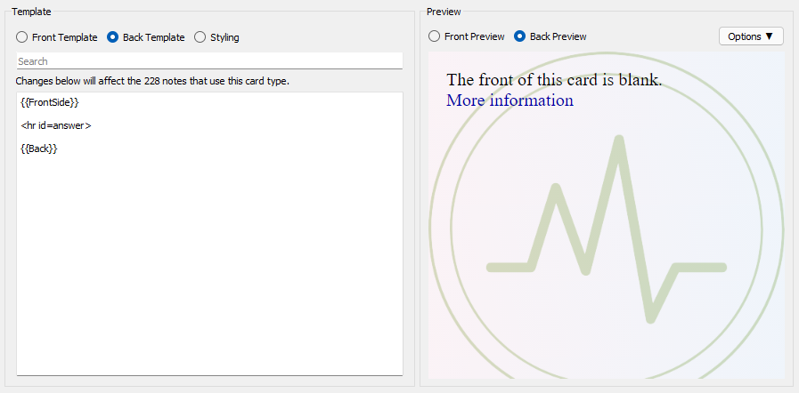

# MedPocket Anki Template

## How to use?

- First, you need to navigate to your `collection.media` folder, and copy `_backgrounds` folder into it.
- Second, replace `the front template`, `the styling` and `the back template`.
- Enjoy!

## Authors

- [AREA44](https://github.com/AREA44)
